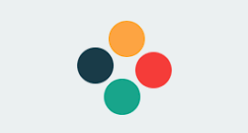
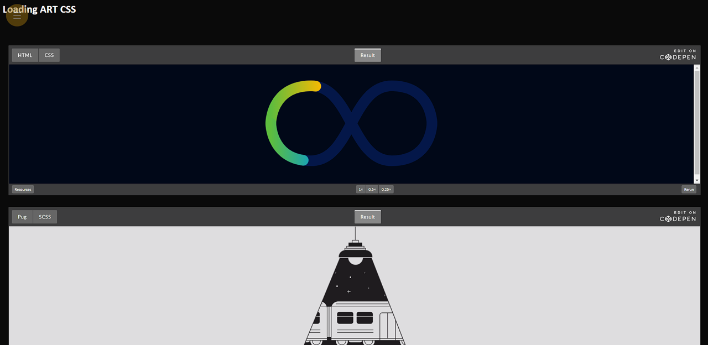

<a name="readme-top"></a>
<div align="center">
  
  [![Contributors][contributors-shield]][contributors-url]
  [![Forks][forks-shield]][forks-url]
  [![Stargazers][stars-shield]][stars-url]
  [![Issues][issues-shield]][issues-url]
  [![MIT License][license-shield]][license-url]
  [![LinkedIn][linkedin-shield]][linkedin-url]

</div>
<br />
<div align="center">
  <a href="https://github.com/voaneves/loading">
    
  </a>
  <h3 align="center">loading</h3>
  <p align="center">
    A concept page showcasing a collection of loading animations from around the web.
    <br />
    <a href="https://github.com/voaneves/loading"><strong>Explore the documentation »</strong></a>
    <br />
    <br />
    <a href="https://voaneves.com/loading">View Demo</a>
    ·
    <a href="https://github.com/voaneves/loading/issues">Report a Bug</a>
    ·
    <a href="https://github.com/voaneves/loading/issues">Request a Feature</a>
  </p>
</div>

<details>
  <summary>Table of Contents</summary>
  <ol>
    <li>
      <a href="#about-the-project">About the Project</a>
      <ul>
        <li><a href="#technologies-used">Technologies Used</a></li>
      </ul>
    </li>
    <li><a href="#features">Features</a></li>
    <li><a href="#getting-started">Getting started</a></li>
    <li><a href="#to-do">To Do</a></li>
    <li><a href="#reporting-bugs">Reporting Bugs</a></li>
    <li><a href="#license">License</a></li>
  </ol>
</details>

## About the project

<p align="center">
  <a href="https://voaneves.com/loading">
    
  </a>
</p>

This repository is a compilation of various loading animations found on the internet. The page is hosted at [voaneves.com/loading](https://voaneves.com/loading).

<p align="right">(<a href="#readme-top">back to top</a>)</p>

### Technologies Used

The project uses the following technologies:

- HTML
- CSS
- JavaScript

<p align="right">(<a href="#readme-top">back to top</a>)</p>

## Features

This project includes the following features:

- A variety of loading animations.
- Well-documented code for each loading animation.

<p align="right">(<a href="#readme-top">back to top</a>)</p>

## Getting started

1. Clone this repository to your machine:

   ```bash
   git clone https://github.com/voaneves/loading.git
  
2. Open the index.html file in a web browser.

3. Use the mouse to select colors while moving it.

4. If you click on the selected color, a sliding notification will appear and show which color you selected and copy it to the clipboard.

<p align="right">(<a href="#readme-top">back to top</a>)</p>

## To do

- [ ] Add more loading animations.
- [X] Optimize for mobile devices.
- [X] Update README.md images.

<p align="right">(<a href="#readme-top">back to top</a>)</p>

## Reporting bugs

Found a bug or issue in the project? Follow the steps below:

1. Check if the bug has already been reported in our "Issues" section on GitHub: link to Issues.

2. If you don't find an existing report about the bug, click on "New Issue" to open a new bug report.

3. Provide a clear and descriptive title for the bug, along with a detailed description of the steps needed to reproduce it.

4. If possible, include screenshots, relevant code snippets, or any other information that may help identify and resolve the bug.

5. Click on "Submit Issue" to create the bug report.

Thank you for reporting bugs! If you would like to contribute with code, you can open a PR, and your participation is more than welcome.

<p align="right">(<a href="#readme-top">back to top</a>)</p>

## License

This project is licensed under the MIT License.

<p align="right">(<a href="#readme-top">back to top</a>)</p>

[contributors-shield]: https://img.shields.io/github/contributors/voaneves/loading.svg?style=for-the-badge
[contributors-url]: https://github.com/voaneves/loading/graphs/contributors
[forks-shield]: https://img.shields.io/github/forks/voaneves/loading.svg?style=for-the-badge
[forks-url]: https://github.com/voaneves/loading/network/members
[stars-shield]: https://img.shields.io/github/stars/voaneves/loading.svg?style=for-the-badge
[stars-url]: https://github.com/voaneves.com/loading/stargazers
[issues-shield]: https://img.shields.io/github/issues/voaneves/loading.svg?style=for-the-badge
[issues-url]: https://github.com/voaneves/loading/issues
[license-shield]: https://img.shields.io/github/license/voaneves/loading.svg?style=for-the-badge
[license-url]: https://github.com/voaneves/loading/blob/master/LICENSE.txt
[linkedin-shield]: https://img.shields.io/badge/-LinkedIn-black.svg?style=for-the-badge&logo=linkedin&colorB=555
[linkedin-url]: https://linkedin.com/in/voaneves
